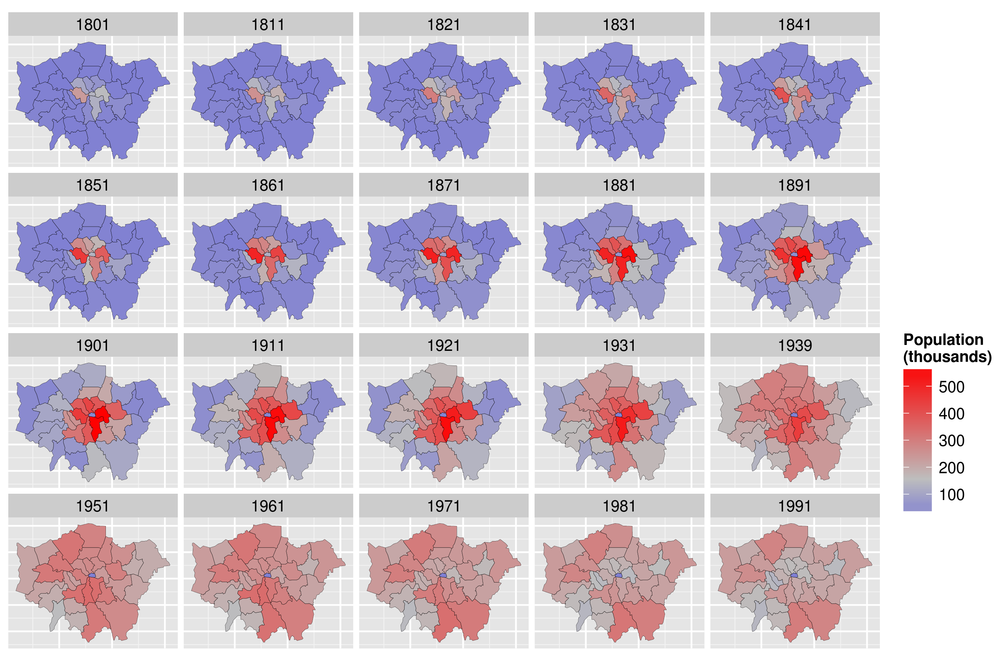
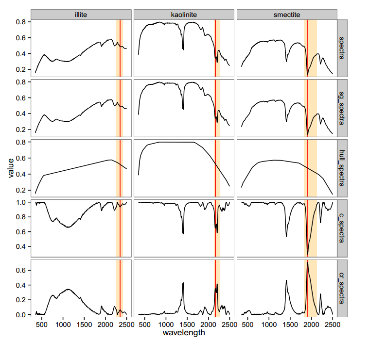

```{r setup, include = FALSE}
library(knitr)
```

# What is ggplot2?

## ggplot2

- `ggplot2` is a graphical system to make plots using the 'Grammar of Graphics'
- Helpful for thinking about plots

<aside class="notes">
Here are some notes.
</aside>

## Grammar of graphics

- A way to think about graphics
- Graphics are mapping of data to aesthetic attributes of geometric objects
- May also contain transformations and facetting

## ggplot2 itself

- Developed by Hadley Wickham and has been out since 2005
- Mainly focused on static graphics
- `ggvis` is for interactive graphs - I don't recommend it
 * `plotly` is better

# Making a basic plot

## Load some data

```{r load}
library(ggplot2)
mpg
```

## Basic scatter plot

```{r basic-scatter}
ggplot(mpg, aes(x = cty, y = hwy)) +
  geom_point()
```

## Colour by cylinders

```{r colour-scatter}
ggplot(mpg, aes(x = cty, y = hwy, colour = cyl)) +
  geom_point()
```

## Cylinders as class

```{r colour-cylclass-scatter}
ggplot(mpg, aes(x = cty, y = hwy, colour = as.factor(cyl))) +
  geom_point()
```

## Change colour scale

```{r colour-cylclass-colour}
ggplot(mpg, aes(x = cty, y = hwy, colour = as.factor(cyl))) +
  geom_point() + scale_color_brewer(palette = "YlOrRd") + theme_dark()
```


## Size by cylinders

```{r size-scatter}
ggplot(mpg, aes(x = cty, y = hwy, size = cyl)) +
  geom_point()
```

## Shape by cylinders

```{r shape-scatter}
ggplot(mpg, aes(x = cty, y = hwy, shape = as.factor(cyl))) +
  geom_point(size = 3)
```

## Facet by cylinders

```{r facet-scatter}
ggplot(mpg, aes(x = cty, y = hwy)) +
  geom_point() + facet_grid(.~cyl)

```

# Other transformations

## Adding stats

```{r stat-lm}
ggplot(mpg, aes(x = cty, y = hwy)) +
  geom_point() + geom_smooth(method = "lm")
```

## Changing coordinates - diamonds

```{r diamonds}
ggplot(diamonds, aes(x = carat, y = price)) +
  geom_point()
```

## Log transform

```{r diamonds-transform}
ggplot(diamonds, aes(x = carat, y = price)) +
  geom_point() + coord_trans(x = "log10", y = "log10")
```

# Other kinds of plots

## Bar charts

```{r barchart}
ggplot(mpg, aes(x = as.factor(cyl), y = hwy)) + 
  geom_bar(stat = "summary", fun.y = "mean")
```

## Bar charts with polar coordinates

```{r piechart}
ggplot(mpg, aes(x = factor(1), y = hwy, fill = as.factor(cyl))) + 
  geom_bar(stat = "summary", fun.y = "mean", width = 1) + coord_polar(theta = "y")
```

## Boxplots

```{r boxplots}
ggplot(mpg, aes(x = as.factor(cyl), y = hwy)) + 
  geom_boxplot()
```

## Violin plots

```{r violinplots}
ggplot(mpg, aes(x = as.factor(cyl), y = hwy)) + 
  geom_violin()
```

## Heatmaps

```{r heatmap}
ggplot(diamonds, aes(x = carat, price))+ 
  geom_hex()
```

## Contour plots

```{r contour}
ggplot(diamonds, aes(x = carat, price))+ 
  geom_point() + geom_density_2d() 
```

# Interactive plots

## plotly

```{r plotly, message=FALSE, echo = 2:4}
library(plotly)
g <- ggplot(mpg, aes(x = cty, y = hwy, colour = as.factor(cyl))) +
  geom_point(); ggplotly(g)
```

# Super advanced plots

## London population over time



----


