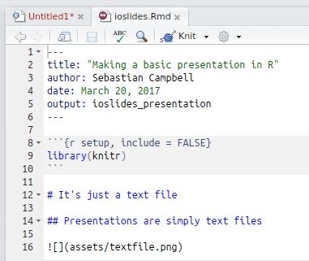
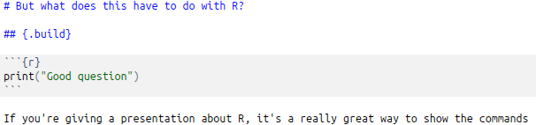

```{r setup, include = FALSE}
library(knitr)
```

# It's all simple text

## Presentations are written in markdown



## Classic slides

- Basic point form
- Most presentations are like this

```{r, eval = FALSE}
## Classic slides

- Basic point form
- Most presentations are like this
```

## Step by step

> - But I can stop and pause
> - for effect

```{r, eval = FALSE}
## Step by step

> - But I can stop and pause
> - for effect
```

# But what does this have to do with R?

## {.build}

```{r}
print("Good question")
```

If you're giving a presentation about R, it's a really great way to show the commands



## You can even focus on specific parts (hp) {.smaller}

```{r}
sb <- as.data.frame(datasets::Seatbelts)
sb$law <- as.logical(sb$law)
### <b>
summary(lm(front ~ law, data = sb))
### </b>
```

<div class="notes">
We can see here from our crude analysis that seatbelts save ~300 lives/month
</div>


## Yeah, but I don't give presentations _about_ R {.build .smaller}

That's ok

```{r, echo = FALSE}
plot(1:10, (1:10)^2, type = "l", xlab = "Use of automated tools", ylab = "Ease of embedding R created plots")
```

# And also: interactive plots!

----

```{r, message=FALSE, echo = -(1:2)}
pokemon <- data.table::as.data.table(highcharter::pokemon)
pokemon <- data.table::melt(pokemon, measure.vars =  c("type_1",  "type_2"), 
                variable.name = "type_level", value.name = "type", na.rm = TRUE)
library(highcharter)
hcboxplot(pokemon$defense, pokemon$type)
```

# Not to mention embedding anything on a web page

----

<iframe width="420" height="315"
src="http://intranet.fao.org">
</iframe>

# Ok, this is nice, but how do I do it?

## Small leap from text to presentation

One line of code:

`rmarkdown::render("ioslides/ioslides.Rmd")`

